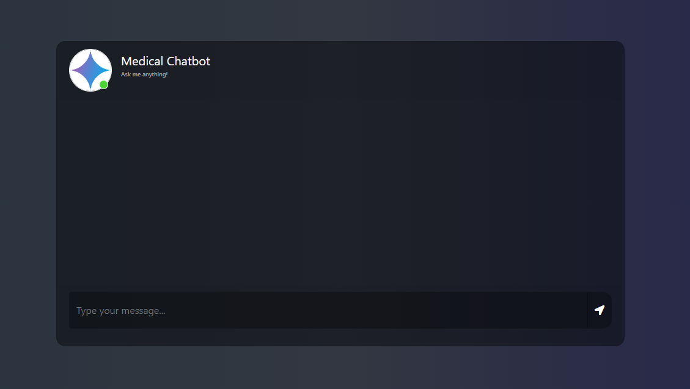
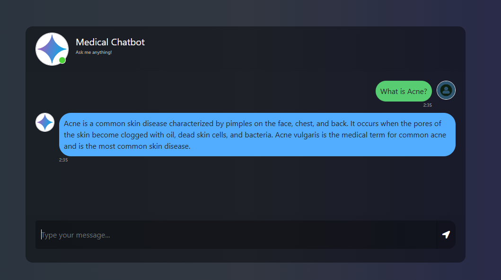

# RAG-based Medical Chatbot


> A Retrieval-Augmented Generation (RAG) based chatbot designed to provide accurate and personalized medical information to users.

## 🚀 Features

- **Personalized Responses:** Delivers tailored medical information based on user queries.
- **Reliable Sources:** Utilizes trusted medical databases to ensure information accuracy.
- **Interactive Interface:** Engages users through a conversational platform for seamless interaction.

## 🛠️ Installation

1. **Clone the repository:**

   ```sh
   git clone https://github.com/Raza-Aziz/RAG-based-Medical-Chatbot.git
   cd RAG-based-Medical-Chatbot
   ```

2. **Set up a virtual environment:**

   ```sh
   conda create -n medibot python=3.10 -y
   source env/bin/activate  # On Windows, use 'env\Scripts\activate'
   conda activate medibot   # Alternative to above line
   ```    

   
3. **Create a `.env` file in the root directory and add your Pinecone credentials as follows:**

    ```sh
    PINECONE_API_KEY = "xxxxxxxxxxxxxxxxxxxxxxxxxxxxx"
    GOOGLE_API_KEY = "xxxxxxxxxxxxxxxxxxxxxxxxxxxxx"
    ```

4. **Install dependencies:**
    All the dependencies are in requirements.txt, so you can install them all by simply running

   ```sh
   pip install -r requirements.txt
   ```

## 📌 Usage

1. **Prepare the data:**

   - Place your medical documents in the `data/` directory. (PDF Files only!!)

2. **Index the data:** By running

   ```sh
   python store_index.py
   ```

3. **Run the chatbot:**

   ```sh
   python app.py
   ```

4. **Access the chatbot interface:**

   Open your web browser and navigate to `http://localhost:8080`.

## 🧐 Explanation

This chatbot follows the Retrieval-Augmented Generation (RAG) approach to provide accurate and context-aware medical responses:

1. **Data Preparation:**
    * Medical documents are stored in the `data/` directory in PDF Format
    * These documents serve as the knowledge base for the chatbot.

2. **Indexing Process (`store_index.py`):**
    * Loads medical documents from the `data/` folder using:
        * `src.helper.load_pdf_file`
    * Splits text into chunks of size 500 by using `src.helper.text_split`, which uses `RecursiveCharacterTextSplitter`
    * Downloads an embedding model from Hugging Face to convert text into vector representations:
        * `sentence-transformers/all-MiniLM-L6-v2`
    * Creates a Pinecone index to store embeddings.
    * Stores the document embeddings in Pinecone for efficient retrieval.

3. **Chatbot Execution (`app.py`):**
    * Loads the pre-built Pinecone index for retrieval:
        ```python
        docsearch = PineconeVectorStore.from_existing_index(index_name, embeddings)
        ```
    * Sets up a retriever to fetch the most relevant medical document chunks:
        ```python
        retriever = docsearch.as_retriever(search_type='similarity_score_threshold', search_kwargs={'k' : 3, 'score_threshold': 0.6})
        ```
    * Uses Google's Gemini AI model for response generation:
        ```python
        llm = ChatGoogleGenerativeAI(model='gemini-2.0-flash', temperature=0.4, max_tokens=500)
        ```
    * Combines document retrieval and response generation into a pipeline:
    ```python
    question_answer_chain = create_stuff_documents_chain(llm, prompt)
    rag_chain = create_retrieval_chain(retriever, question_answer_chain)
    ```
    * Defines an API endpoint to handle chat requests and return AI-generated responses.

4. **User Interaction:**
    * Users can interact with the chatbot via a web interface available at `http://localhost:8080`.
    * The chatbot retrieves relevant medical information and generates responses using RAG techniques.

## 🖼️ Screenshots

| Feature            | Screenshot                                      |
|--------------------|-------------------------------------------------|
| Chat Interface     |   |
| Response Example   |  |

## 📄 License

This project is licensed under the MIT License - see the [LICENSE](LICENSE) file for details.

## 👨‍💻 Contact

For any questions, feel free to reach out:

- GitHub: [@Raza-Aziz](https://github.com/Raza-Aziz)
- Email: razaaziz9191@gmail.com


